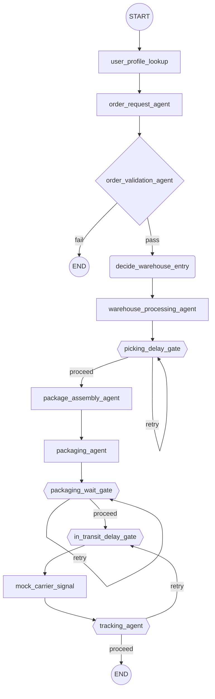

# Logistics Multi-Agent POC (LangGraph)

A minimal multi-agent implementation of an ontology-based logistics workflow, built with LangGraph for learning and portfolio purposes.

## Purpose

This code isn't the final portfolio piece — the goal is to implement and understand the core patterns of multi-agent systems (State design, conditional branching, self-loops, the decision/intervention distinction) firsthand. The plan is to reference this alongside other case studies later to build the actual portfolio.

The project aims to cover endpoints beyond humans — sensors and robots (actuators) too. Early on, the design goal was a structure where Agent-to-Agent and Agent-to-Sensor/Actuator communication took priority over human endpoints — but the actual implementation ended up closer to each node judging independently and connecting only through the graph's static edge order. `mock_carrier_signal` (standing in for what would be a carrier webhook) and the Sensor/Action calls in the warehouse-processing agent are traces of that original intent (log-tag level at most), not real agent-to-agent interaction — see DESIGN.md's "Open questions" section for details.

## Architecture Diagram



**Shape legend**: `((circle))` START/END · `[rectangle]` plain function node, no judgment involved · `{diamond}` conditional branch (no self-loop) · `(rounded rectangle)` Supervisor judgment (no self-loop) · `{{hexagon}}` repeating gate (judgment + loop — the `retry` arrow loops back to itself or to another node in the same loop).

`in_transit_delay_gate → mock_carrier_signal → tracking_agent` isn't three nodes each running their own self-loop — they're bundled into **one combined loop** (see DESIGN.md's "Reviewed and kept as-is" section for the history behind this structural change).

| Node | Category | Description (per each node function's docstring) |
|---|---|---|
| `user_profile_lookup` | Entry · Lookup | Loads `delivery_addresses` (address book) / `payment_method` / `notification_enabled` from the login session |
| `order_request_agent` | Entry · Event | Builds `item_list` from the confirmed order (not a cart) |
| `order_validation_agent` | Gate · Conditional branch | Validates `payment_status` and the delivery address → pass/fail |
| `decide_warehouse_entry` | Decision (Supervisor) | Decides whether to proceed to warehouse processing (`decision_type=proceed_to_warehouse`). Still a stub (fixed decision) since it's rule-only as long as there's no exception |
| `warehouse_processing_agent` | Loop (built-in) | Iterates `item_list`: Sensor (locate) → Action (pick). Items carrying an `item_delay_reason` just skip picking and pass through |
| `picking_delay_gate` | Judgment + loop · self-loop | Item-based. Only re-checks resolution for items with an `item_delay_reason`, self-looping otherwise. Once the retry limit is exhausted, falls back to the Stage1 automatic ruling (unrecoverable → cancel the item; recoverable → auto-apply partial-fulfillment/consolidated-shipping based on the buyer's stored preference) |
| `package_assembly_agent` | Aggregate · conditional count | Groups unassigned items into Packages by delivery address; seals the Package and issues a `tracking_number` once `required==arrived` |
| `packaging_agent` | Action | Bulk-transitions picked items belonging to a sealed Package to packaging-complete |
| `packaging_wait_gate` | Judgment + loop · self-loop (pure watcher) | Only watches unsealed Packages (`tracking_number is None`) — doesn't resolve anything itself. Runs compensation (refund) once the retry limit is exhausted |
| `in_transit_delay_gate` | Judgment + loop · combined loop (see above) | Checks `delay_categories` on sealed Packages. Natural disasters trigger immediate compensation; everything else asks the Supervisor (`predict_delay_escalation`, a real Gemini call) whether it's recoverable, every tick. Unconditionally wired to `mock_carrier_signal`/`tracking_agent`, so it's re-invoked every tick during transit rather than just once before shipping starts |
| `mock_carrier_signal` | Action (POC-only signal generator) | Advances only the sealed Packages **with no unresolved delay** (has `delay_categories` but no `compensation` yet) through the fixed sequence `packed → shipped → in transit → delivered`, filling in a placeholder GPS point. Skips delayed Packages so they don't block other Packages in the same order (Principle 6). In a real service, carrier webhook/Kafka events would take this node's place |
| `tracking_agent` | Judgment + loop · derived-value recompute | Doesn't generate signals — just looks at the current `item_status`/`delay_categories` and recomputes the Order's derived values (`internal_order_status`, `customer_facing_status`). `route_after_in_transit_cycle` checks both "are there still undelivered items" and "are there still unresolved delayed Packages" → loops back into `in_transit_delay_gate` if either is true, otherwise ends |

## Core Design Principles (6)

1. **Keep the source of truth at the layer where the event actually happened.** Decide ownership by which layer — Item / Package / Order — the event occurred in: stock shortages and inspection failures belong to Item, traffic delays and natural disasters belong to Package, and anything summarizing multiple items/packages belongs to Order (always a derived value).
2. **Separate sequential stages (enum) from cross-cutting conditions (bool/list).** A progress stage where only one value can hold at a time is an enum; something that can coexist with other values (like a delay flag) gets its own field.
3. **Split "current value" and "past snapshot" into separate roles — judgment vs. record.** The current setting used for judgment and the snapshot kept as evidence are different fields; snapshots only get added where inquiry response, auditing, or traceability actually calls for them.
4. **Only call a node an "Agent" if it requires judgment (inference).** Simple lookups, counts, or event reflection are plain function nodes, not Agents.
5. **Order-to-Package is 1:N, never N:M.** A single order's items can be split across multiple Packages by delivery address, but there's no scenario where multiple orders get consolidated into one Package.
6. **Asynchronous partial shipping is the default, not full synchronization (waiting on a Join).** Each Package/Item proceeds independently as soon as it's ready — "partially shipped" isn't a problem state, it's normal under this policy.

## Running It

```powershell
venv\Scripts\python.exe main.py
```

There's no test framework — verification happens by running `main.py`'s 13 demo scenarios and checking the output (JSON summaries). When `in_transit_delay_gate` hits a delay category, it calls the Supervisor's `predict_delay_escalation` (a real Google Gemini call). Without `GOOGLE_API_KEY` set in `.env`, that call fails and falls back to `escalate_now=False`, so the demo still runs to completion without an API key — you just need the key to see real predictions. That's the only point that actually hits the network, so scenarios exercising it can produce different results run to run (non-determinism).

## Key Findings / Lessons

- **Redesigning the human-intervention workflow (v16).** Distinguished "decision" (the system deciding on its own) from "intervention" (a person stepping into a decision already made), and split the primary decision-maker not by layer (Item vs. Package) but by **"who actually has the information needed to decide."** Since only warehouse staff know the physical state of inventory, the Item domain (picking-delay gate) routes through a human (staff) Stage1 ruling first; the Package domain (in-transit gate) can't treat items within an already-sealed Package differently from one another, so human intervention becomes structurally unnecessary there. See DESIGN.md's "Core concepts > Decision vs. intervention vs. escalated" section for the full process.
- **Favor absorbing logic into existing nodes over adding new ones.** The shipping/dispatch agents were absorbed into the tracking agent on the grounds that they're "not a physical action, just a reflection of an external signal," and the Join node was absorbed into the package-assembly agent's counting logic during the sync-to-async transition. Asking "can this be absorbed into an existing node?" before adding a new one is a habit this project kept coming back to.
- **Delay causes split into three layers that each need a different response** — ① codified rules with a fixed resolution point (stock shortages, say — no Supervisor needed), ② normal delays that need prediction (traffic delays — LLM judgment territory), ③ disruptions that break the normal flow entirely (natural disasters — can't be exhaustively enumerated, so a fallback is required). Not lumping these three into a single field or node was the key call here.
- **Gaps between code and design docs only surface through code review.** In v16, a field changed, but one piece of derived-value logic never picked up the change — under certain conditions, the order status just froze in place after the graph had already finished running. It was found by reproducing it with an actual demo scenario. Putting the design doc and the code side by side and asking "is this field actually being used everywhere it should be?" is a core exercise in this project.
- **A judgment validated in one domain doesn't necessarily transfer to another.** Within a narrow scope (a loop between two nodes), it looked like Principle 6 ("each Package/Item proceeds independently once it's ready") held up — the problem was extending that same judgment to a broader scope (the in-transit gate as a whole). In reality, even delay-free Packages were blocked from starting shipment until another Package in the same order resolved its own delay. This only surfaced once a reproduction scenario measured it directly, and got fixed by restructuring three nodes into a single combined loop. See DESIGN.md's "Reviewed and kept as-is" section and JOURNAL.md's Stage 7 for the details.

## More Details

- **[DESIGN.md](DESIGN.md)** — The design reference doc (Korean), focused on "why we decided this" and "what we discarded" rather than "what we built." Covers the node list, State schema, things removed or merged, open questions, and a rundown of unimplemented/dead fields.
- **[JOURNAL.md](JOURNAL.md)** — The detailed record (Korean) of "how we got to that conclusion": stage-by-stage execution logs, scenario-verification logs, how gaps were discovered, and hypotheses that got discarded along the way.
