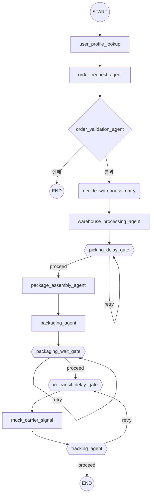

# 물류 멀티에이전트 POC (LangGraph)

온톨로지 기반 물류 워크플로우를 LangGraph로 구현한 학습/포트폴리오용 멀티에이전트 최소 구현체입니다.

## 목적

이 코드 자체가 최종 포트폴리오는 아닙니다 — 멀티에이전트 시스템의 핵심 패턴(State 설계,
조건분기, self-loop, 판단/개입의 구분)을 직접 구현해보고 이해하는 데 목적이 있으며, 이후 다른
사례를 참고·엮어서 포트폴리오화할 예정입니다.

엔드포인트를 사람뿐 아니라 센서·로봇(액추에이터)까지 포함하는 것을 지향합니다. 설계 초기에는
Agent-to-Agent, Agent-to-Sensor/Actuator 통신이 사람 endpoint보다 우선순위 높은 구조를
목표로 했습니다 — 하지만 실제 구현은 각 노드가 독립적으로 자기 몫만 판단하고 그래프의 정적인
edge 순서로만 연결되는 구조에 가깝습니다. `mock_carrier_signal`(실제로는 택배사 웹훅 자리)이나
창고처리agent의 Sensor/Action 호출은 그 지향점의 흔적(로그 태그 수준)일 뿐, 에이전트 간 실제
상호작용은 아닙니다 — 상세는 [DESIGN.md](DESIGN.md) "아직 결정 안 된 것" 참고.

## 아키텍처 다이어그램



**도형 범례**: `((원))` START/END · `[사각형]` 판단 없는 일반 함수 노드 · `{다이아몬드}` 조건분기
(self-loop 없음) · `(둥근사각형)` Supervisor 판단(self-loop 없음) · `{{육각형}}` 반복 게이트
(판단+반복. `retry` 화살표가 자기 자신 또는 같은 루프 내 다른 노드로 돌아감).

`in_transit_delay_gate → mock_carrier_signal → tracking_agent`는 각 노드가 따로 self-loop를
도는 게 아니라 **세 노드가 하나의 통합 루프**로 묶여 있습니다 — `in_transit_delay_gate`가 이번
틱의 지연을 처리하고(미해소 지연 패키지는 그대로 둠), `mock_carrier_signal`이 그중 지연이
없는 패키지만 전진시키고, `tracking_agent`가 파생값을 재계산해 "아직 배송완료 못한 item이
있거나 미해소 지연 패키지가 남아있으면" `in_transit_delay_gate`로 되돌아갑니다
(`route_after_in_transit_cycle`). 지연 패키지 하나가 같은 주문의 무지연 패키지까지
order-wide로 막던 gap을 고치며 이렇게 재구성했습니다 — 이전에는 `in_transit_delay_gate`가
배송 시작 전 딱 한 번만 전체를 검사하고, 일단 통과하면 `mock_carrier_signal ↔ tracking_agent`
둘만 따로 순환했습니다(DESIGN.md "검토 후 현재 구조 유지로 확정" 참고).

| 노드 | 분류 | 설명 (각 노드 함수 docstring 기준) |
|---|---|---|
| `user_profile_lookup` | 진입 · 조회 | 로그인 세션에서 `delivery_addresses`(주소록)/`payment_method`/`notification_enabled` 로드 |
| `order_request_agent` | 진입 · 이벤트 | 확정된 주문내역(장바구니 아님)으로 `item_list` 생성 |
| `order_validation_agent` | 관문 · 조건분기 | `payment_status`, 배송지 검증 → 통과/실패 |
| `decide_warehouse_entry` | 판단 (Supervisor) | 창고처리 진입 여부 판단(`decision_type=proceed_to_warehouse`). 예외가 없으면 규칙만으로 결정되는 판단이라 아직 더미(고정 판단) |
| `warehouse_processing_agent` | 반복 (내장 루프) | `item_list` 순회, Sensor(위치확인)→Action(피킹). `item_delay_reason`이 있는 item은 피킹만 스킵하고 그대로 넘김 |
| `picking_delay_gate` | 판단+반복 · self-loop | Item 기반. `item_delay_reason` 있는 item만 대상으로 해소 여부 재확인, self-loop. 재시도 예산 소진 시 Stage1 자동판정(회복불가→품목취소, 회복가능→선호도 기반 부분수령/합배송 자동 적용) |
| `package_assembly_agent` | 집계 · 조건카운트 | 미배정 item을 배송지별 Package로 묶고, `required==arrived`면 봉인+`tracking_number` 발급 |
| `packaging_agent` | 액션 | 봉인된 Package 소속의 피킹완료 item을 일괄 포장완료로 전이 |
| `packaging_wait_gate` | 판단+반복 · self-loop (순수 워처) | 미봉인 Package(`tracking_number is None`) 감시만 함, 스스로 해소하지 않음. 재시도 예산 소진 시 보상조치(환불) |
| `in_transit_delay_gate` | 판단+반복 · 통합 루프(위 참고) | 봉인된 Package의 `delay_categories` 체크. 자연재해는 즉시 보상조치, 그 외엔 매 틱 Supervisor(`predict_delay_escalation`, Gemini 실제 호출)에게 회복가능 여부를 먼저 묻고 판단. `mock_carrier_signal`/`tracking_agent`와 무조건 edge로 묶여 배송 시작 전 1회가 아니라 배송 진행 중에도 매 틱 재호출됨 |
| `mock_carrier_signal` | 액션 (POC 전용 신호 발생기) | 봉인된 Package 중 **미해소 지연(`delay_categories` 있고 `compensation` 없음)이 없는 것만** `포장완료→출고됨→배송중→배송완료` 고정 시퀀스로 전진, GPS placeholder 채움. 지연 중인 패키지는 건너뛰어 같은 주문의 다른 패키지를 막지 않음(원칙6). 실제 서비스라면 택배사 웹훅/Kafka 이벤트가 이 자리를 대체 |
| `tracking_agent` | 판단+반복 · 파생 재계산 | 신호를 만들지 않고 현재 `item_status`/`delay_categories`만 보고 Order 파생값(`internal_order_status`, `customer_facing_status`) 재계산. `route_after_in_transit_cycle`이 "미배송 item이 있는가"와 "미해소 지연 패키지가 있는가"를 함께 판단해 → 있으면 `in_transit_delay_gate`로 재진입, 둘 다 없으면 종료 |

## 핵심 설계 원칙 (6가지)

1. **원본은 사건이 실제로 발생한 계층에만 둔다.** Item / Package / Order 중 어디서 일어난
   사건인지로 소속을 결정한다 — 재고부족·검수불량은 Item, 교통지연·자연재해는 Package,
   여러 item/package를 아우르는 요약은 Order(항상 파생값)로.
2. **순차 단계(enum)와 교차 조건(bool/list)은 분리한다.** 동시에 하나만 가능한 진행 단계는
   enum, 다른 값과 동시에 존재 가능한 것(지연 여부 등)은 독립 필드로.
3. **현재값과 과거 스냅샷은 "판단"과 "기록"으로 역할을 분리한다.** 판단에 쓰는 현재 설정값과
   증거로 남기는 스냅샷은 다른 필드다 — 스냅샷은 문의 대응/감사/역추적이 필요한 곳에만 만든다.
4. **판단(추론)이 필요한 노드만 "Agent"라 부른다.** 단순 조회·카운트·이벤트 반영은 Agent가
   아닌 일반 함수 노드다.
5. **Order-Package는 1:N 관계다 (N:M 아님).** 한 주문의 item들이 배송지별로 여러 Package로
   나뉠 수 있지만, 여러 주문을 한 Package로 합포장하는 시나리오는 없다.
6. **완전동기(Join으로 전부 대기) 대신 비동기 부분배송이 기본이다.** 각 Package/Item이
   준비되는 대로 독립 진행하며, "부분배송중"은 문제 상황이 아니라 정책상 정상 상태다.

## 실행 방법

```powershell
venv\Scripts\python.exe main.py
```

테스트 프레임워크는 없습니다 — `main.py`의 데모 시나리오 12개를 실행해 출력(JSON 요약)으로
검증합니다. `in_transit_delay_gate`가 지연 카테고리를 만나면 Supervisor의
`predict_delay_escalation`(Google Gemini 실제 호출)을 탑니다. `.env`의 `GOOGLE_API_KEY`가
없으면 이 호출이 실패하고 `escalate_now=False`로 폴백하므로 데모 자체는 API 키 없이도 끝까지
실행됩니다 — 실제 예측 결과를 보려면 키가 필요합니다. 이 호출만이 실제 네트워크로 나가는
지점이라, 이걸 타는 시나리오는 실행마다 결과가 달라질 수 있습니다(비결정론).

## 주요 발견 / 학습 포인트

- **사람 개입 워크플로우 재설계 (v16).** "판단(decision, 시스템이 스스로 내림)"과 "개입
  (intervention, 사람이 이미 내려진 판단에 손을 댐)"을 구분하고, 1차 판단자를 Item/Package
  같은 계층이 아니라 **"누가 판단에 필요한 정보를 가졌는가"**로 갈랐습니다 — 창고 실물 상태는
  운영자만 알기 때문에 Item 도메인(피킹지연게이트)은 사람(운영자) Stage1 판정이 최초 경로이고,
  Package 도메인(배송중게이트)은 봉인된 패키지가 품목을 차등 취급할 수 없어 구조적으로 사람
  개입 자체가 불필요해집니다. 자세한 과정은 DESIGN.md "사람 개입 워크플로우" 절 참고.
- **노드를 늘리기보다 흡수·통합.** 출고agent/배송출발agent는 "물리적 액션이 아니라 외부 신호
  수신"이라는 이유로 추적agent에 흡수됐고, Join노드는 동기→비동기 전환 과정에서 패키지조립agent의
  카운트 로직으로 흡수됐습니다. 새 노드를 만들기 전에 "기존 노드에 흡수될 수 있는가"를 먼저
  묻는 게 이 프로젝트가 반복해서 확인한 습관입니다.
- **지연 사유는 대응 방식이 다른 세 계층으로 나뉩니다** — ①해소 시점이 고정 가능한 결정화된
  규칙(재고부족 등, Supervisor 불필요) ②예측이 필요한 정상 지연(교통지연, LLM 판단 영역)
  ③정상 흐름 자체가 깨지는 재난(자연재해 등, 전부 나열 불가능해 fallback 필요). 셋을 하나의
  필드/노드로 뭉뚱그리지 않고 분리한 게 핵심 판단이었습니다.
- **코드가 설계 문서를 못 따라가는 지점은 코드 리뷰로만 드러납니다.** v16에서
  `PackageState.escalated`를 `compensation`으로 대체했지만, 파생값 계산 로직(`tracking.py`)이
  이 신규 필드를 전혀 읽지 않아 특정 조건(패키지가 끝내 미봉인된 채 보상조치됨)에서
  `internal_order_status`가 그래프 종료 후에도 영원히 "조립중"에 멈추는 버그가 있었습니다 —
  실제 데모 시나리오로 재현해 확인 후 수정했습니다. 설계 문서(DESIGN.md)와 코드를 나란히 놓고
  "이 필드가 실제로 다 쓰이고 있는가"를 다시 짚어보는 과정 자체가 이 프로젝트의 핵심 훈련입니다.
- **한 도메인에서 검증된 판단을 다른 도메인에 그대로 가져다 쓰면 안 맞을 수 있습니다.**
  JOURNAL.md 4단계는 "`mock_carrier_signal ↔ tracking_agent` 순환 **안에서는** 패키지 간
  서로 막는 의존성이 코드에 없으니 원칙6("각 Package/Item이 준비되는 대로 독립 진행") 위반이
  아니다"라고 방어했고, 그 순환이라는 좁은 범위 안에서는 맞는 판단이었습니다. 문제는 그
  판단을 그대로 "배송중게이트 전체가 원칙6을 지킨다"는 더 넓은 범위로 확장해 받아들인
  것이었습니다 — 정작 그 순환에 **들어가는 시점 자체**를 담당하는 舊
  `route_after_in_transit_gate`는 주문 전체(order-wide) 단위로 판단해, 지연 없는 패키지도
  같은 주문의 다른 패키지가 해소될 때까지 배송 시작 자체가 묶여 있었습니다. 코드 곳곳은
  원칙6을 각자 정직하게 지키는 것처럼 보였지만("문면상"), 검증된 도메인 밖으로 그 판단을
  그대로 가져다 쓴 순간 파이프라인 전체로는 실제로 원칙을 위반하고 있었던 셈입니다 —
  재현 시나리오(main.py 시나리오 12)로 실측하고 나서야 드러난 gap이었고, `in_transit_delay_gate`/
  `mock_carrier_signal`/`tracking_agent`를 하나의 통합 루프로 재구성해 고쳤습니다. 자세한
  내용은 DESIGN.md "검토 후 현재 구조 유지로 확정" 절과 JOURNAL.md 7단계 참고.

## 더 자세한 내용

- **[DESIGN.md](DESIGN.md)** — "무엇을 만들었나"가 아니라 "왜 그렇게 정했나"와 "무엇을
  폐기했나"가 핵심인 설계 참조 문서. 노드 목록, State 스키마, 제거/통합된 것들, 아직 결정 안
  된 것, 미구현/죽은 필드 종합이 여기 있습니다.
- **[JOURNAL.md](JOURNAL.md)** — 단계별 실행 기록, 시나리오 검증 로그, gap 발견 과정, 폐기된
  가설 등 "어떻게 그 결론에 도달했는가"의 상세 기록입니다.
